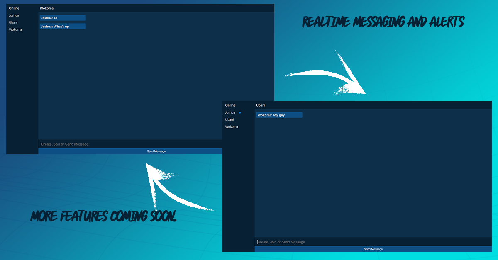

# ChatApp - Private Messaging Web Application

Welcome to ChatApp, a private messaging web application that enables seamless and real-time communication between users on the same network. Built using JavaScript, HTML, CSS, and Socket.IO for the frontend, and Node.js with Express for the backend, ChatApp is designed to provide a secure and efficient way for users to exchange messages privately.

## Table of Contents

- [Introduction](#introduction)
- [Features](#features)
- [Getting Started](#getting-started)
  - [Prerequisites](#prerequisites)
  - [Installation](#installation)
- [Usage](#usage)
- [Technologies Used](#technologies-used)
- [Contributing](#contributing)
- [License](#license)

## Introduction

ChatApp is a private messaging platform that allows users to engage in real-time conversations. It offers a simple and intuitive interface for users to send and receive messages privately, ensuring that their conversations are secure and protected.

## Features

**This Chat App is still under development so more features will be added later**

- **Real-time Messaging**: Exchange messages instantly in a real-time chat environment.
- **Private Conversations**: Engage in one-on-one private conversations with other users.
<!-- - **User Authentication**: Secure user registration and login system. -->
<!-- - **Online Status**: View the online status of other users. -->
- **Message Notifications**: Receive notifications for new messages.
<!-- - **Emojis and Attachments**: Send emojis and attachments in messages. -->

## Getting Started

Follow these instructions to get a local copy of the project up and running on your machine.

### Prerequisites

- Node.js and npm (Node Package Manager) need to be installed on your system.

### Installation

1. Clone the repository: `git clone https://github.com/JuszJo/private-messenger.git`
2. Navigate to the project directory
3. Install backend and frontend dependencies: `npm install`

## Usage

1. Start the backend server: In the root directory, run `npm start`.
2. Access the application by opening your browser and navigating to `http://localhost:3000`.

## Technologies Used

- **Frontend**: JavaScript, HTML, CSS, Socket.IO
- **Backend**: Node.js, Express.js, Socket.IO
- **Database**: No database (for simplicity, messages are stored in memory)

## Contributing

Contributions are welcome! If you'd like to contribute to the project, please follow the these steps:

1. Fork the repository.
2. Create a new branch for your feature: git checkout -b feature-name
3. Make your changes and commit them: git commit -m "Add feature"
4. Push to the branch: git push origin feature-name
5. Submit a pull request detailing your changes.

## License

This project is licensed under the [MIT License](LICENSE).

---

Start messaging privately with ChatApp! If you have any questions or feedback, feel free to contact us.